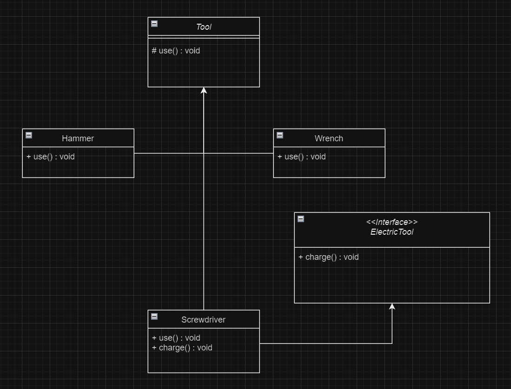

# Лабораторные работы по Java
# Максима Вариант 8
# JDK 23

## Лабораторная работа №1

### [Задание 1](Laba1/Number1.java)
### [Задание 2](Laba1/Number2.java)
### [Задание 3](Laba1/Number3.java)
### [Условие](Laba1/Laba1.docx)

## Лабораторная работа №2

### [Задание 1](Laba2/Laba2Number1.java)
### [Задание 2](Laba2/Laba2Number2.java)
### [Задание 3](Laba2/Laba2Number3.java)
### [Задание 4](Laba2/Laba2Number4.java)
### [Условие](Laba2/Java_2.docx)

## Лабораторная работа №3

### [Задание 1](Laba3/Laba3Number1.java)
### [Условие](Laba3/Java_3.docx)

## Лабораторная работа №4

### [Задание 1](Laba4/Laba4Number1.java)
### [Задание 2](Laba4/Laba4Number2.java)
### [Задание 3 и 4](Laba4/Laba4Number3and4.java)
### [Условие](Laba4/Java_4.docx)

## Лабораторная работа №5

### [Задание 1 и 2](Laba5/Laba5Number1and2.java)
### [UML-диаграмма](Laba5/uml_diagram.html)
### [Условие](Laba5/Java_5.docx)

### [статья](https://habr.com/ru/articles/150041/)